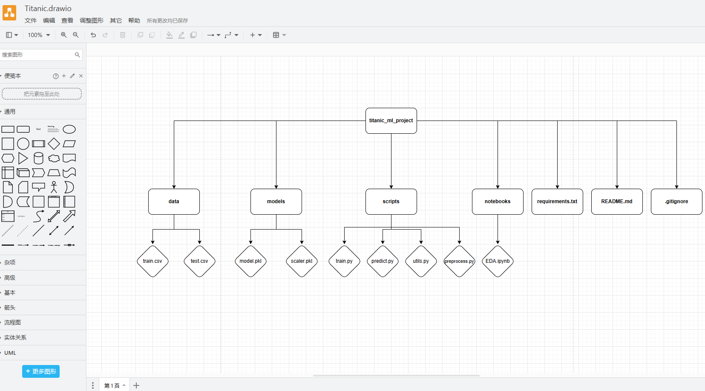

# TP1-Python-production-code
My homework with my informatic course following my teacher and site below https://github.com/Elias-Hr/TP_Production_code. Thanks a lot!

# TP : Python production code

Ce TP permet d'appliquer les notions de dev pour la mise en place d'une solution ML prête à etre mise en production. Il utilse le dataet [Titatnic](https://www.kaggle.com/competitions/titanic/data?select=train.csv). 

Le début du TP commencera par la présentation rapide du IDE VScoduim.

Amusez-vous Bien 😎

## Environnement virtuel

1.  Créez un environnement virtuel pour le projet avec le module venv et activez le.

J'applique ici : 
```bash
python -m venv venv.
```


2.  Lisez depuis les packages utilisées dans le notebook, créez une liste des packages requis dans un fichier "requirements.txt"
    1.  1.  Installer ces packages avec le gestionnaire pip
        2.  Spécifiez les versions de packages dans le requirments.txt. utilisez la commande "pip freeze"


## Notebook

A faire pour les deux Notebook.

1.  Utilisez le notebook depuis VScoduim en choisissant l'interpréteur python dans l'environnement virtuel.
2.  Complétez les cellules manquantes dans l'étude.
```bash
import pandas as pd
from sklearn.model_selection import train_test_split
data = pd.read_csv("D:/TP1 Python production code/TP_Production_code-master/data/train.csv",sep = ',',header = 0)
target = 'Survived'     ### '''not survived''' (Not Minuscule s  in the data.columns) Also for Cabin
def read_data(path:str) -> pd.DataFrame:   ###  pd.Dataframe  is wrong with minuscule frame
    return pd.read_csv(path)
X_train['cabin'] = X_train['cabin'].fillna('M').str[0]
X_test['cabin'] = X_test['cabin'].fillna('M').str[0]
print(X_train['cabin'].unique())  ### see only num of Cabin 
vars_cat = X_train.select_dtypes(include=['object']).columns
```


# %%
## Programmation modulaire

1.  Transformer les notebook en fichier python. Utilisez Vscoduim directement sans faire copier coller des cellules
2.  Modifier le code en écrivant en fonction les différents parties du code.
3.  Proposez une structure (arborescence) du projet pour une programmation modulaire.
    - Utilisez cet outils en ligne : [Drawio](https://app.diagrams.net)
4.  Ecrivez sous forme de module tout le projet
    1.  N'oubliez pas de mettre de fonction (main) train.py et predict.py


```bash
###Q1:
### VSCodium permet de convertir un notebook (.ipynb) en script Python (.py) sans copier-coller grâce à l’option d’exportation intégrée.

### Méthode : 
### Utiliser l'exportation intégrée dans VSCodium
### Ouvrez votre notebook (.ipynb) dans VSCodium.
### Cliquez sur l'icône du notebook (en haut à droite).
### Sélectionnez "Export As → Python Script".
### Enregistrez le fichier .py dans le projet.

###Q2.
import pandas as pd
import numpy as np
import re
from sklearn.model_selection import train_test_split
from sklearn.preprocessing import StandardScaler
from sklearn.linear_model import LogisticRegression
from sklearn.metrics import accuracy_score, roc_auc_score

def load_data(train_path, test_path):
    """Charge les données depuis les fichiers CSV"""
    train_data = pd.read_csv(train_path)
    test_data = pd.read_csv(test_path)
    
    if 'Survived' in test_data.columns:
        test_data = test_data.drop(columns=['Survived'])
    
    return train_data, test_data

def preprocess_data(data):
    """Effectue le prétraitement des données"""
    # Gestion des valeurs manquantes
    data['Cabin'] = data['Cabin'].fillna('M').str[0]
    
    for var in ['Age', 'Fare']:
        data[var + '_NA'] = np.where(data[var].isnull(), 1, 0)
        median_val = data[var].median()
        data[var].fillna(median_val, inplace=True)
    
    return data

def train_model(X_train, y_train):
    """Entraîne un modèle de régression logistique"""
    model = LogisticRegression(C=0.0005, random_state=0)
    model.fit(X_train, y_train)
    return model

def evaluate_model(model, X, y):
    """Évalue la performance du modèle"""
    preds = model.predict(X)
    probs = model.predict_proba(X)[:, 1]
    print(f'ROC-AUC: {roc_auc_score(y, probs)}')
    print(f'Accuracy: {accuracy_score(y, preds)}')

def main():
    train_path = "data/train.csv"
    test_path = "data/test.csv"
    
    # Charger les données
    train_data, test_data = load_data(train_path, test_path)
    
    # Séparer les features et la cible
    X = train_data.drop(columns=['Survived'])
    y = train_data['Survived']
    
    # Diviser en train/test
    X_train, X_test, y_train, y_test = train_test_split(X, y, test_size=0.2, random_state=0)
    
    # Prétraitement
    X_train = preprocess_data(X_train)
    X_test = preprocess_data(X_test)
    
    # Standardisation
    scaler = StandardScaler()
    X_train = pd.DataFrame(scaler.fit_transform(X_train), columns=X_train.columns)
    X_test = pd.DataFrame(scaler.transform(X_test), columns=X_test.columns)
    
    # Entraînement du modèle
    model = train_model(X_train, y_train)
    
    # Évaluation
    print("Évaluation sur le train set:")
    evaluate_model(model, X_train, y_train)
    
    print("\nÉvaluation sur le test set:")
    evaluate_model(model, X_test, y_test)

if __name__ == "__main__":
    main()
```
###Q3.
Structure du projet


###Q4
Pour créer cette structure sous PowerShell :

powershell
mkdir titanic_ml_project
cd titanic_ml_project
mkdir data models scripts notebooks
touch requirements.txt README.md .gitignore
touch scripts/train.py scripts/predict.py scripts/preprocess.py scripts/utils.py

## Règles du code

1.  Utilisez le typing des des fonctions en mettant les inputs, outputs souhaités et espérés.
2.  Ajoutez la docstring pour les fonctions avec le l'extension autodocstring de VScoduim
3.  Remplacez les prints par des logs en utilisant le package [loguru](/C:/Users/AliHARCH/AppData/Local/Programs/Joplin/resources/app.asar/%5Bhttps:/github.com/Delgan/loguru "%5Bhttps://github.com/Delgan/loguru")
4.  Ajoutez la gestion des erreurs dans le code (try except & finally)
5.  Appliquez ce [linter](https://marketplace.visualstudio.com/items?itemName=charliermarsh.ruff) pour améliorer la vibilité et la lecture du code
6.  Profilez le code avec les deux module [line_profiler](https://github.com/pyutils/line_profiler) et [memory_profiler.](https://github.com/pythonprofilers/memory_profiler)

```bash
from typing import List, Tuple
from loguru import logger
import numpy as np
import pandas as pd
from sklearn.model_selection import train_test_split
from sklearn.preprocessing import StandardScaler
from sklearn.linear_model import LogisticRegression
from sklearn.metrics import accuracy_score, roc_auc_score
from memory_profiler import profile

logger.add("app.log", rotation="500 MB")

def add_numbers(a: int, b: int) -> int:
    return a + b

def get_names() -> List[str]:
    return ["Alice", "Bob", "Charlie"]

def divide(a: int, b: int) -> float:
    try:
        result = a / b
        logger.info(f"Division: {a} / {b} = {result}")
        return result
    except ZeroDivisionError:
        logger.error("Division by zero error")
        return float('inf')

def read_file(file_path: str) -> str:
    try:
        with open(file_path, "r") as file:
            content = file.read()
        return content
    except FileNotFoundError:
        logger.error("File not found")
        return ""
    finally:
        logger.info("File read operation completed")

def find_frequent_labels(df: pd.DataFrame, var: str, rare_perc: float):
    tmp = df.groupby(var)[var].count() / len(df)
    return tmp[tmp > rare_perc].index

def preprocess_data(data: pd.DataFrame) -> pd.DataFrame:
    data['Cabin'] = data['Cabin'].fillna('M').str[0]
    for var in ['Age', 'Fare']:
        data[var + '_NA'] = np.where(data[var].isnull(), 1, 0)
        median_val = data[var].median()
        data[var].fillna(median_val, inplace=True)
    return data

def train_model(X_train: pd.DataFrame, y_train: pd.Series) -> LogisticRegression:
    model = LogisticRegression(C=0.0005, random_state=0)
    model.fit(X_train, y_train)
    return model

def evaluate_model(model, X: pd.DataFrame, y: pd.Series):
    preds = model.predict(X)
    probs = model.predict_proba(X)[:, 1]
    logger.info(f'ROC-AUC: {roc_auc_score(y, probs)}')
    logger.info(f'Accuracy: {accuracy_score(y, preds)}')

@profile
def compute():
    data = [x**2 for x in range(100000)]
    return sum(data)

def faulty_function():
    x = 10
    y = 0
    return x / y

train_path = "data/train.csv"
test_path = "data/test.csv"

train_data = pd.read_csv(train_path)
test_data = pd.read_csv(test_path)

if 'Survived' in test_data.columns:
    test_data = test_data.drop(columns=['Survived'])

X = train_data.drop(columns=['Survived'])
y = train_data['Survived']

X_train, X_test, y_train, y_test = train_test_split(X, y, test_size=0.2, random_state=0)

X_train = preprocess_data(X_train)
X_test = preprocess_data(X_test)

scaler = StandardScaler()
X_train = pd.DataFrame(scaler.fit_transform(X_train), columns=X_train.columns)
X_test = pd.DataFrame(scaler.transform(X_test), columns=X_test.columns)

model = train_model(X_train, y_train)

evaluate_model(model, X_train, y_train)
evaluate_model(model, X_test, y_test)

compute()

try:
    faulty_function()
except Exception as e:
    logger.error(f"Error: {e}")

print(add_numbers(5, 10))
print(get_names())
print(divide(10, 2))
print(divide(10, 0))
```
## Débogage

1.  Simulez une erreur dans le code et utilisez le débugger python de Vscoduim pour la trouvez (capture d'écran pour le rendu)

Suppose that we still have the same error in README_Titanic_my_Notebook.py :  target = 'survived' in the 26th line, which s is not capital(Majuscul). We can use:

F5 to activate Debug mode and we will find the errors.


## Bonus

Vous avez remarquez que lorsqu'on utilise un nouveau module il faudrait à chaque fois revenir sur le fichier des requirementes et le rajouter en mettant en place sa version exacte.

Il y'a un risque d'oublie, d'incompatibilité avec les versions de dépendances. ça serai bien si on avait un gestionnaire de projet python qui permettrai de :

- Ajoutez automatiquement un package au fichier des prérequis une fois installer.
- Qui remplace à la fois le mudule venv et pip.
- Séparer les prérequis utilisez lors du dev (profiler) et ceux dans la prod
- Générer une srtucture de fichier pour un nouveau projet
- ... etc

Cette outil s'appelle [UV](https://github.com/astral-sh/uv)

&nbsp;

&nbsp;
